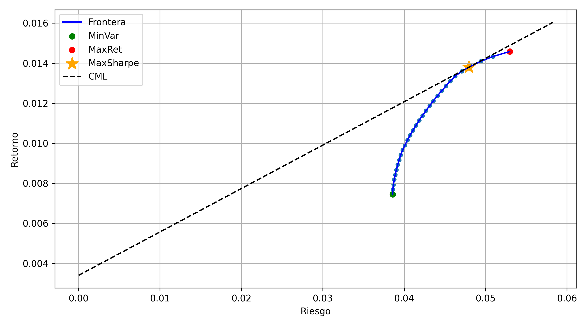
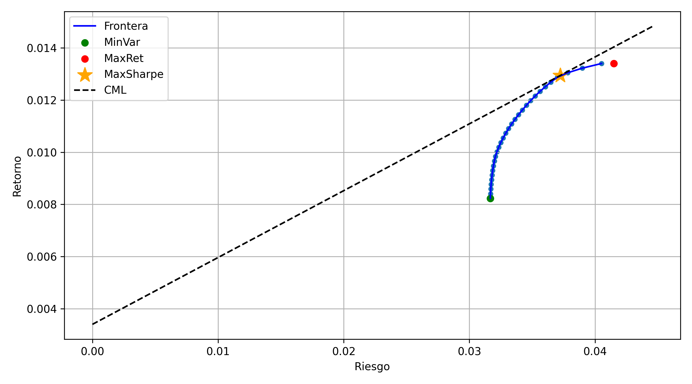
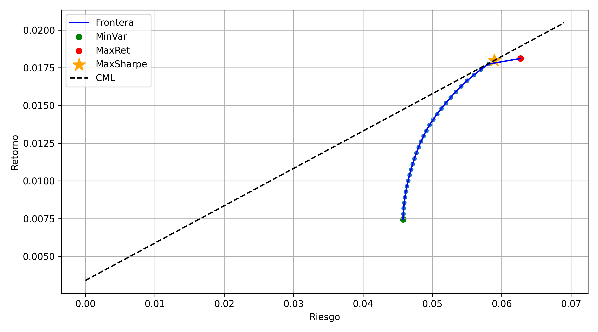

# Global Portfolio Optimization

## Markowitz Portfolio Theory, Risk Analysis and Monte Carlo Simulation

This academic project applies modern portfolio theory to construct,
optimize, and evaluate globally diversified investment portfolios.

The analysis considers 70 stocks from seven countries and combines
historical market data, quantitative optimization, risk measurement,
scenario simulation, and portfolio performance evaluation.

> This project is presented for educational and portfolio purposes.
> It does not constitute financial or investment advice.

## Project Overview

The objective was to examine how diversification and quantitative
optimization can support portfolio construction under different
risk-return preferences.

The investment universe includes companies from:

- Chile
- Brazil
- Mexico
- Spain
- France
- Germany
- United States

Ten companies were selected from each market, resulting in a total of
70 assets from industries such as technology, banking, energy, mining,
healthcare, telecommunications, retail, and consumer goods.

Historical adjusted prices were obtained with monthly frequency,
covering the period from January 2017 to April 2025.

## Project Objectives

The project addresses the following objectives:

- Collect historical market data for 70 international stocks.
- Calculate logarithmic returns and individual volatility.
- Estimate covariance and correlation between assets.
- Construct a global minimum-variance portfolio.
- Construct a portfolio that maximizes the Sharpe ratio.
- Estimate the maximum-return portfolio.
- Generate the Markowitz efficient frontier.
- Compare conservative and aggressive investment strategies.
- Construct a portfolio with a target Beta of 1.20.
- Estimate Value at Risk using Monte Carlo simulation.
- Evaluate portfolio performance against the S&P 500.

## Methodology

### 1. Market Data Collection

Historical adjusted prices were collected from Yahoo Finance for 70
stocks and their corresponding market indices.

Monthly return series were calculated for each asset and organized by
country for subsequent analysis.

### 2. Portfolio Optimization

Portfolio weights were estimated using the Markowitz mean-variance
framework.

The main optimization constraints were:

- The portfolio weights must sum to 100%.
- Short selling is not allowed.
- Financial leverage is not allowed.
- Each asset has a minimum allocation of 1%.
- Each asset has a maximum allocation of 10%.

The analysis includes:

- Minimum-variance portfolio.
- Maximum-Sharpe portfolio.
- Maximum-return portfolio.
- Thirty intermediate efficient portfolios.
- Capital Market Line.

### 3. Risk-Profile Portfolios

The assets were divided into two groups according to their historical
individual volatility:

- **Conservative portfolio:** composed of the 35 assets with the lowest
  individual risk.
- **Aggressive portfolio:** composed of the 35 assets with the highest
  individual risk.

Minimum-variance and maximum-Sharpe strategies were estimated for both
groups.

### 4. Target-Beta Portfolio

An additional portfolio was optimized to achieve a target systematic
risk level:

```text
Target Beta = 1.20
```

The optimization minimized total portfolio variance while satisfying
the target Beta and allocation constraints.

### 5. Value at Risk and Simulation

Monte Carlo simulations were performed using Oracle Crystal Ball to
evaluate the distribution of potential monthly returns.

The simulation process included:

- 10,000 simulated scenarios.
- Monthly expected returns.
- Monthly portfolio volatility.
- Value at Risk estimation.
- Comparison across global, conservative, aggressive, and target-Beta
  strategies.

### 6. Performance Evaluation

The optimized portfolios were evaluated using market observations from
January to April 2025.

Portfolio performance was compared with the S&P 500 as a benchmark.
This evaluation represents a historical academic exercise and should
not be interpreted as evidence of future performance.

## Key Results

- The global minimum-variance portfolio achieved an estimated monthly
  volatility of approximately **3.85%** and an expected monthly return
  of approximately **0.74%**.
- The global maximum-Sharpe portfolio achieved an estimated monthly
  volatility of approximately **4.79%**, an expected monthly return of
  approximately **1.38%**, and a Sharpe ratio close to **0.21**.
- The conservative portfolio produced lower estimated volatility than
  the aggressive portfolio.
- The aggressive portfolio offered higher expected returns at the cost
  of greater volatility.
- Minimum-variance strategies showed comparatively stable performance
  during the January-April 2025 evaluation period.
- The global minimum-variance portfolio recorded a geometric return of
  approximately **2.12%**, compared with approximately **1.30%** for
  the S&P 500 during the same period.
- Maximum-Sharpe strategies produced mixed results when applied to
  restricted asset groups, illustrating their sensitivity to the
  selected investment universe.

## Main Visualizations

### Global Efficient Frontier



### Conservative Portfolio



### Aggressive Portfolio



## Tools and Technologies

- Python
- Jupyter Notebook
- Microsoft Excel
- Oracle Crystal Ball
- Yahoo Finance
- Quantitative optimization
- Monte Carlo simulation

## Repository Structure

```text
global-portfolio-optimization/
├── notebooks/
│   ├── 01_market_data_collection.ipynb
│   ├── 02_portfolio_optimization.ipynb
│   ├── 03_additional_analysis.ipynb
│   └── README.md
├── spreadsheets/
│   ├── 01_returns_by_country.xlsx
│   ├── 02_betas_by_country.xlsx
│   ├── 03_portfolio_optimization_results.xlsx
│   ├── 04_max_sharpe_simulation.xlsx
│   ├── 05_beta_target_portfolio.xlsx
│   ├── 06_aggressive_portfolio.xlsx
│   ├── 07_conservative_portfolio.xlsx
│   ├── 08_portfolio_var.xlsx
│   ├── 09_aggressive_portfolio_simulation.xlsx
│   ├── 10_conservative_portfolio_simulation.xlsx
│   ├── 11_beta_portfolio_simulation.xlsx
│   ├── 12_portfolio_forecast.xlsx
│   └── README.md
├── images/
│   ├── global_efficient_frontier.png
│   ├── conservative_efficient_frontier.png
│   ├── aggressive_efficient_frontier.png
│   ├── max_sharpe_var_cdf.png
│   ├── max_sharpe_var_pdf.png
│   └── README.md
├── reports/
│   ├── global-portfolio-optimization-report.pdf
│   └── README.md
├── README.md
└── .gitignore
```

## Project Report

The complete methodology, mathematical formulation, results, and
conclusions are available in the public project report:

[View the complete project report](reports/global-portfolio-optimization-report.pdf)

Personal identification numbers were removed from the public version
before publication.

## Limitations

- The analysis relies on historical market observations.
- Historical returns do not guarantee future performance.
- Expected returns and covariance estimates are sensitive to the
  selected period.
- Transaction costs, taxes, liquidity restrictions, and currency
  conversion effects were not fully incorporated.
- The simulation assumes statistical distributions that may not
  represent extreme market conditions.
- Some spreadsheet simulations require Oracle Crystal Ball to be
  reproduced completely.

## Academic Context

This project was developed as part of the **Finance II** course during
the first semester of 2025.

It was completed collaboratively by:

- Vicente Hadad
- Martín Huerta
- Sebastián Tello
- Cristóbal Vargas

The repository preserves the collaborative nature of the original
academic work. Contributor names should only be published with their
authorization.

## Author Contact

**Martín Huerta**

- GitHub: [martinhm2026](https://github.com/martinhm2026)
- LinkedIn: [Add LinkedIn profile]

## Disclaimer

This repository is intended exclusively for educational and portfolio
purposes. The results are based on historical data and simplified
assumptions. Nothing in this project should be interpreted as financial
advice or a recommendation to buy or sell any security.
